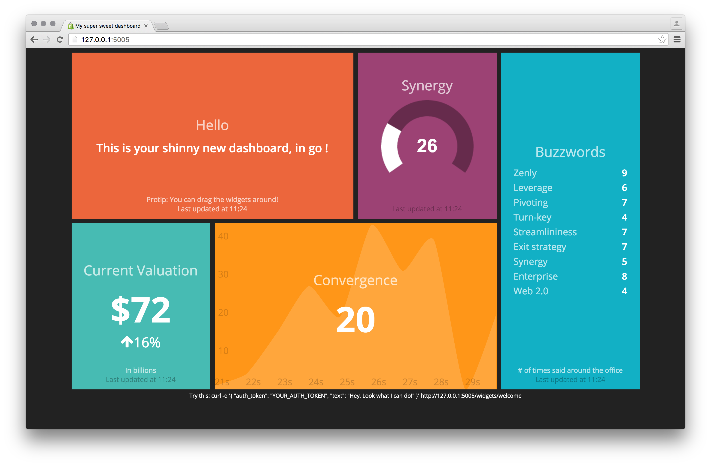

#  Go-Dashing

[](https://godoc.org/github.com/znly/go-dashing)

Go-Dashing is Golang port of the [fabulous Dashing framework](http://shopify.github.com/dashing), that lets you build beautiful dashboards. It looks great, especially on TVs.

It uses the native Dashing assets, which lets you use all the original Dashing widgets, only the jobs need to be written in Go. To do this, it uses [go-sprockets](https://github.com/znly/go-sprockets), which is a port of the [sprockets](https://github.com/rails/sprockets) asset pipeline, embedding `libsass` to compile the original SASS assets, and `duktape` to run the CoffeeScript compiler.



## Installation
Get the package:

```bash
$ go get github.com/znly/go-dashing
```

## How to use
Building a dashboard is easy, for instance [`examples/sample/sample.go`](examples/sample.go):
```go
package main

import (
	"log"

	dashing "github.com/znly/go-dashing"
	"github.com/znly/go-dashing/jobs/buzzwords"
	"github.com/znly/go-dashing/jobs/convergence"
	"github.com/znly/go-dashing/jobs/sample"
)

func main() {
	// Create a new DashingGo server running the sample dashboard
	dashingDashboards, err := dashing.NewDashing("www", "javascripts", "sample", "auth-dev", "127.0.0.1", "5005", false)
	if err != nil {
		log.Fatalf("Err: %s", err)
	}

	// Register default sample jobs
	dashingDashboards.Register(sample.GetJob(), convergence.GetJob(), buzzwords.GetJob())

	// Start the server
	log.Fatal(dashingDashboards.Start())
}
```

And run it with:
```bash
$ go run examples/sample/sample.go
```

You will need two directories from the Dashing repo: `www` and `javascripts`. We also ship the directories with this repo.

##  WARNING

Go-Dashing is using some native libraries (such as `libsass` and `duktape`), and thus may take some time to compile. Use ```go install``` to avoid recompiling them too often.

## Examples:

You can look at the examples in [example directory](examples/) and/or run in go-dashing directory ```go run examples/sample/sample.go```

## Jobs

To create your own jobs, implement the Job interface.(see the [jobs/](https://github.com/znly/go-dashing/tree/master/jobs) directory for examples):
```go
type Job interface {
    Work(chan *dashingtypes.Event)
}
```

Then register them with `Dashing.Register()`:
```go
mydashboard.Register(sample.GetJob())
```

## More Info

You should check on the [Dashing webpage](http://shopify.github.com/dashing) for more info about how to make widget and the logic behind dashing.

## License
Licensed under the Apache License, Version 2.0.
